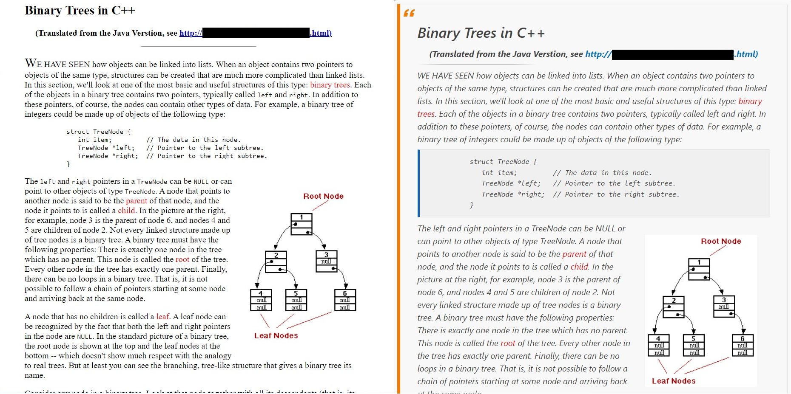

#  Page Styler

> Chrome extension that add classless CSS to unstyled webpages

This extension will provide you with a couple CSS classless libraries and a simple, easy to use UI to inject CSS styles on unstyled webpages.

## Install 🚀

Download the extension and store it in a place where it will be easy for you to locate. next ,Open your chrome browser then navigate to `chrome://extensions` or look for the extensions icon 🧩 on the top bar, click on it then select `manage extensions`, a page will show up with all your extensions, switch on `Developer mode` located on the navigation bar, a dropdown will show up with the option to `Load unpacked`, click on it and select the folder where you downloaded the "Page-Styler" extension.

## Usage ✋

After successfully installing the extension, click on the extensions icon 🧩 on the top bar, a dropdown menu will show up with the list of installed extensions, you will find the `Page Styler`  and next to it will be the 📌 icon, click on it to pin it on the top bar, now you can click on the  icon and select the style you want from the dropdown menu, then click `Apply` button to see changes. 

### Note 🚩

If you feel that the installation proccess is hard to understand then remember it's the same proccess for all chrome extensions which mean you can always search online how to install a chrome extension. for more infomations visit [Chrome Extension Development Basics](https://developer.chrome.com/docs/extensions/mv3/getstarted/development-basics/).

## Supported CSS Libraries

Currently the `Page Styler` support five CSS libraries

- Mini CSS (Dark)
- Mini CSS (Default)
- MVP CSS v1.12
- Simple CSS v1.0
- Water CSS

## Extension in Action 🔥

## Customization 🎨

If you didn't like the pre-installed CSS libraries then you can add your own to the extension by simply adding your custom CSS file to the `/styles` directory and editing the `styles.js` file to include a new javascript object with a unique `name` to display and the filename as the `path`.

## Reason of Development ❓

While searching for articles to learn coding, I stumbled upon old online articles, they were useful and helped me alot, but the only problem was they had minimal to no styles, plus they did not support "Dark Mode" at all.

So I worked on making this extension to change the appearance of those web pages and make them more comfortable to read.

## Why publishing on GitHub ❗

This extension was intended to be published on `Chrome Web Store`, but I found out that I need to make an account and pay a one time fee of $5! but since I'm poor as F*** and unemployeed programmer (actually I never worked as a programmer), I decided to publish it on `GitHub` hoping that other people could benefit from it. 